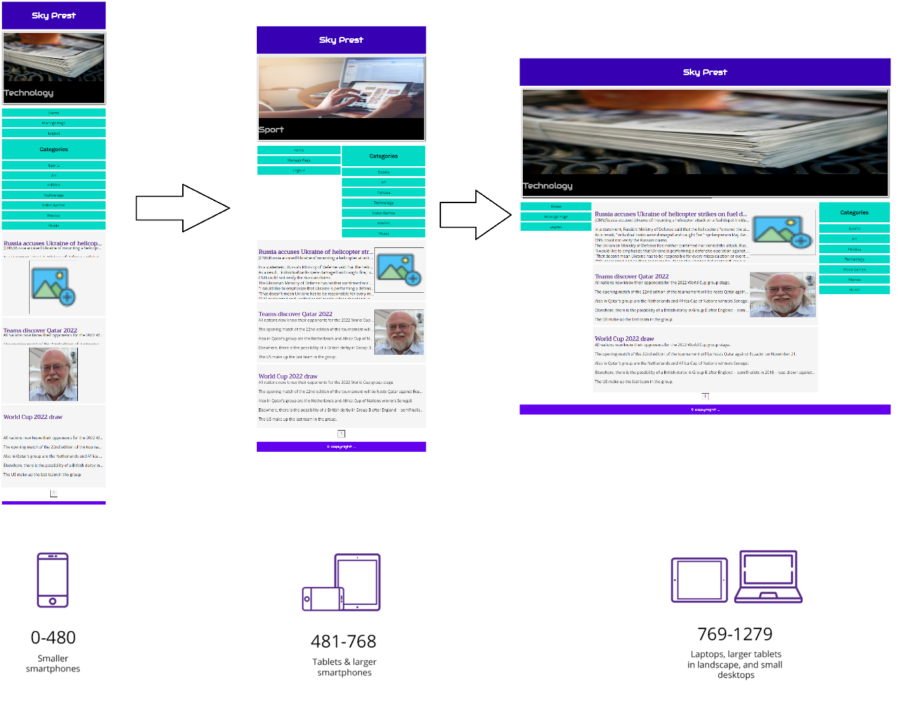

# SkyPress-NewsWebsite
A news website called Sky Press

## Table of Contents
* [General Info](#general-information)
* [Technologies Used](#technologies-used)
* [Screenshots](#screenshots)
* [Setup](#setup)
* [Usage](#usage)
* [Project Status](#project-status)
* [Room for Improvement](#room-for-improvement)
* [Contact](#contact)

## General Information
This project is about a news website that gives the admin of the website the chance to post news in different categories. The admin needs a username and a password to login and be able to make changes in the website. 

## Technologies Used
-  HTML
-  CSS
-  PHP
-  SQL
-  Java Script
## Screenshots

## Setup
You can run this program on your local machine by opening the index.php file on a browser having all the files

## Usage
Website displays news and give the admin the ability to make changes using a username and a password.

## Project Status
Project is: Complete

## Room for Improvement
- Adding a types to the users so each user would have different authorities to make changes on the website.

## Contact
Created by Pouya Pirhandeh - feel free to contact me via email!
my email: ppirhandeh@gmail.com

